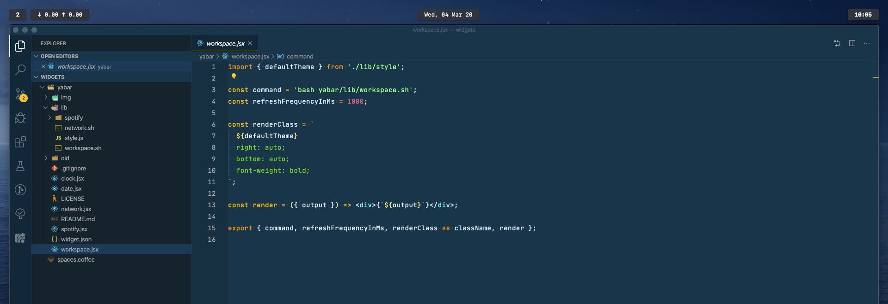

# yabar

A [yabai](https://github.com/koekeishiya/yabai) status bar widget for [Übersicht](https://github.com/felixhageloh/uebersicht).

## Features

- Active workspace number
- Battery indicator
- Connected WiFi name
- Volume
- Date

## Screenshot



## Installation

Clone this repo to your Übersicht widgets directory.

```bash
$ git clone https://github.com/AlexNaga/yabar $HOME/Library/Application\ Support/Übersicht/widgets/nibbar
```

## Dependencies

- [jq](https://github.com/stedolan/jq) — used for parsing json output and displaying the workspaces widget
  - install with homebrew: `brew install jq`
- [SF Mono Fonts](https://developer.apple.com/fonts/) (optional) — used for symbols in the statusbar widget
- [ifstat](http://macappstore.org/ifstat/) — used for Übersicht widget

# Setup

You will be need spotify oAuth token for [web
api](https://developer.spotify.com/documentation/web-api/reference/tracks/get-track/).
You can get one from
[here](https://developer.spotify.com/console/get-track/?id=3n3Ppam7vgaVa1iaRUc9Lp)
by clicking **Get Token**. _THIS TOKEN WILL BE EXPIRED QUICK_

```sh
echo -n "TOKEN_HERE" > "${HOME}/Library/Application Support/Übersicht/widgets/yabar/lib/spotify/token.sec"
```
